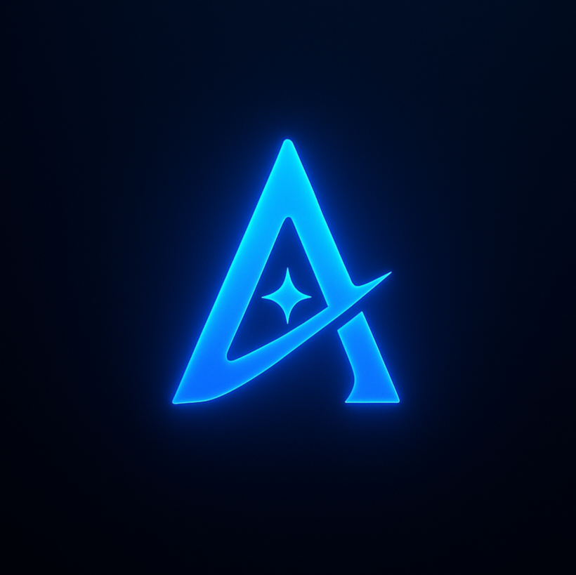
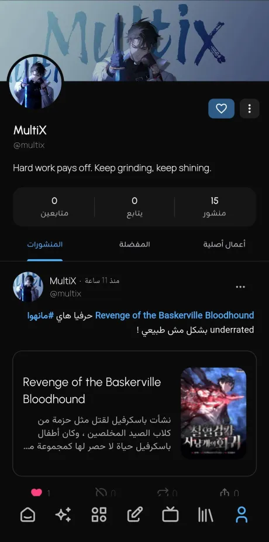
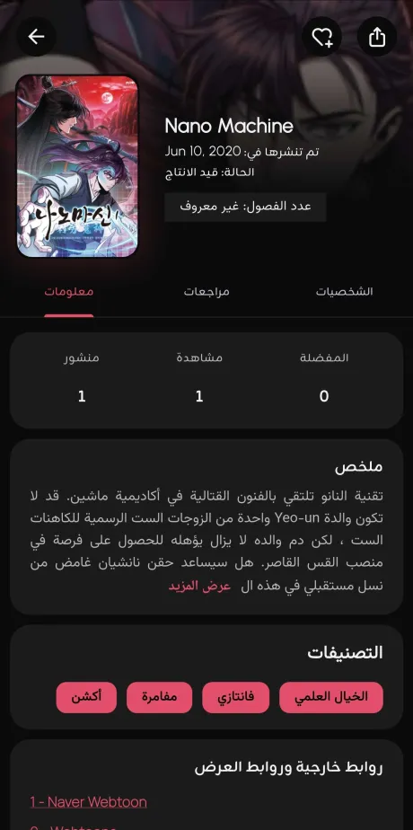
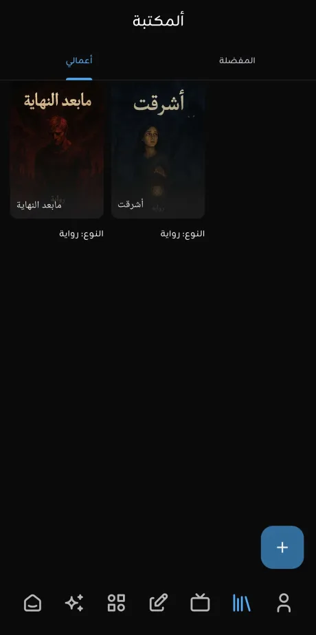
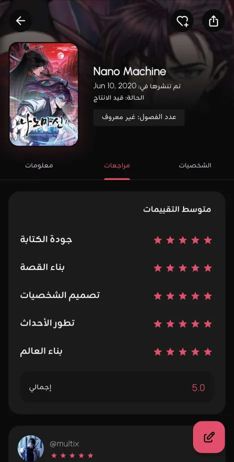
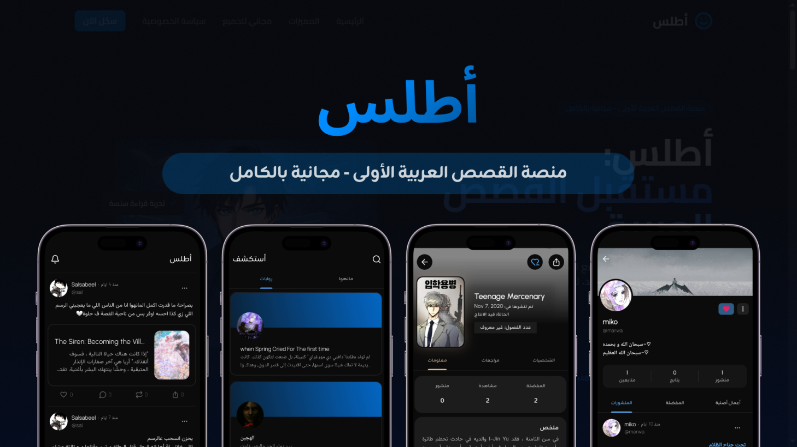
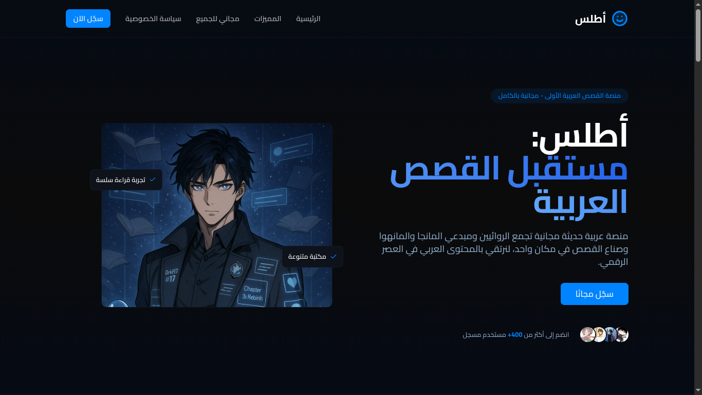

  

<h1 align="center">Atlas</h1>

  <b>An intelligent, creator-first platform redefining the way local manga and manhwa are published, read, and shared.</b>

  <a href="#overview">Overview</a> •
  <a href="#features">Features</a> •
  <a href="#screenshots">Screenshots</a> •
  <a href="#tech-stack">Tech Stack</a> •
  <a href="#vision">Vision</a>

---

## Overview

**Atlas** is a next-generation platform dedicated to **independent manga and manhwa creators**.  
It’s designed to empower artists, writers, and readers through a unified ecosystem that blends **community, technology, and design excellence**.

Built with a modern architecture and refined user experience, Atlas offers:
- Seamless publishing and discovery for indie authors.  
- Thoughtful interaction systems for readers.  
- AI-enhanced moderation and personalization tools.  

> The codebase currently exceeds **31,000 lines of code**, reflecting months of development and continuous refinement.

---

## Features

### For Creators
- Publish and showcase **original manga, manhwa, and novels**.  
- Reach readers through clean layouts and integrated analytics.  
- Benefit from a **fair, community-first model** that promotes visibility.

### For Readers
- Explore **authentic indie works** unavailable on mainstream platforms.  
- **Interact with paragraphs** — comment, like, and share specific moments.  
- Enjoy **intelligent notifications** and curated reading suggestions.

### For the Community
- **AI-driven moderation** ensures a healthy creative environment.  
- **Discussions for popular titles** like *Solo Leveling* (without hosting them).  
- Built-in **visual quote generator** for sharing story moments.  

### For Developers
- **Go-based backend** with PostgreSQL and Node.js AI microservices.  
- Modular, scalable, and optimized architecture for modern growth.  
- Fully documented database views and notification systems.

---

## Screenshots

### Mobile Interface

  
  
  
  

---

### Design Banner

  

---

### Landing Page

  

---

## Tech Stack

| Layer | Technology |
|-------|-------------|
| **Frontend** | Flutter |
| **Backend** | Go |
| **Database** | PostgreSQL |
| **AI / Embeddings** | Node.js microservices |
| **Storage** | Supabase (initially), migrated to PostgreSQL |
| **Infrastructure** | Modular architecture with scalable APIs |

---

## Vision

Atlas aims to become the **home of indie storytelling** — a refined ecosystem where creators can publish freely, readers can engage deeply, and technology silently enhances the experience.  
Through its commitment to design, community, and innovation, Atlas is building a future where local stories stand on a global stage.

---

  Designed and developed with precision and passion — Atlas © 2025

